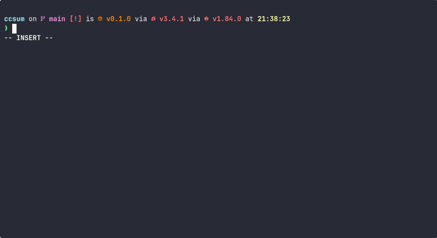

# ccsum / Convenient Checksum

[](https://asciinema.org/a/UyBRrE558UWQNprA4J2RXgcYc)
ccsum is sha256sum (md5sum, sha1sum, and sha512sum) with improved usability.

## Features

- Colored output
- Sort by name

## Installation

```bash
cargo install --git https://github.com/sevenc-nanashi/ccsum.git
```

## Usage

<!-- usage starts here -->
```
Usage: ccsum [OPTIONS] [FILES]...

Arguments:
  [FILES]...  the files to generate the checksum for

Options:
      --completion <COMPLETION>  print shell completion script [possible values: bash, elvish, fish, powershell, zsh]
  -b, --binary                   read in binary mode. (noop)
  -t, --text                     read in text mode. (noop)
  -c, --check                    check for differences between the new and original file
  -a, --algorithm <ALGORITHM>    use the specified algorithm to generate the checksum [default: sha256] [possible values: md5, sha1, sha256, sha512]
  -h, --help                     Print help
  -V, --version                  Print version

Display options:
      --tag       create a BSD-style checksum
  -z, --zero      end each output line with a NULL character instead of newline, and disable file name escaping
      --color     colorize the output, even if stdout is not a tty
      --no-color  disable colorized output

Check mode options:
      --ignore-missing  don't fail or report status for missing files
      --quiet           don't put OK for each successfully verified file
      --status          don't output anything. you can use status code to check for success
      --strict          exit non-zero for improperly formatted checksum lines
  -w, --warn            warn about improperly formatted checksum lines

Group mode options:
  -g, --group[=<GROUP>]
          group output by last N segments of the path
  -G, --group-with-check[=<GROUP_WITH_CHECK>]
          group output by last N segments of the path, and fail if any checksums in the group are different
```
<!-- usage ends here -->

## License

This project is licensed under the [MIT license](LICENSE).
